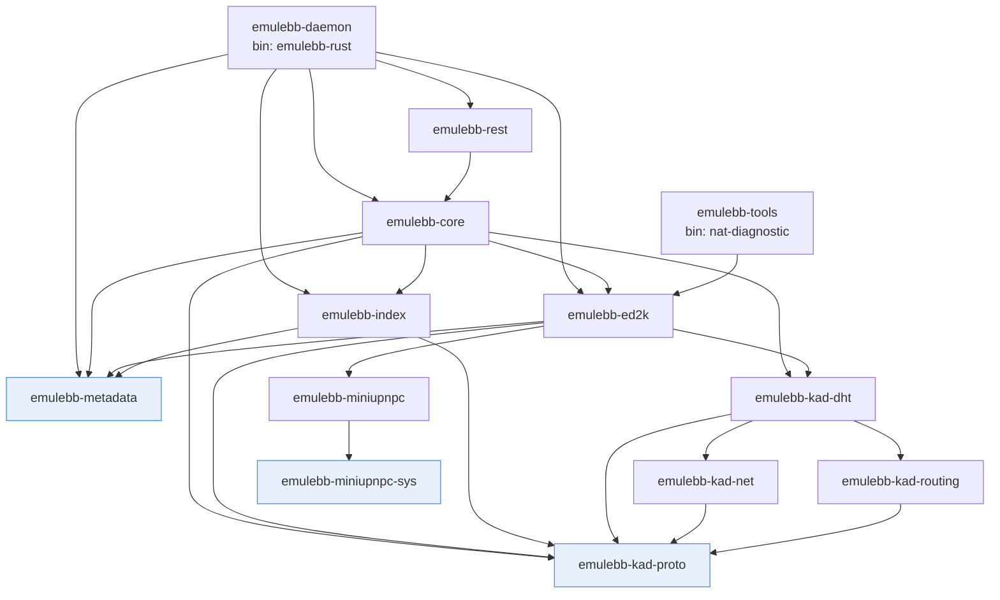
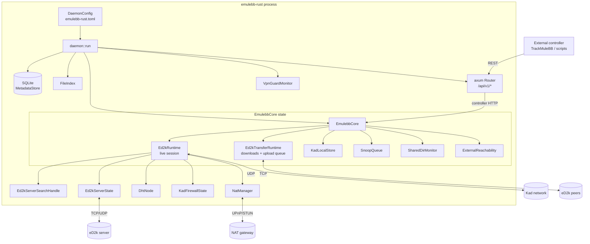
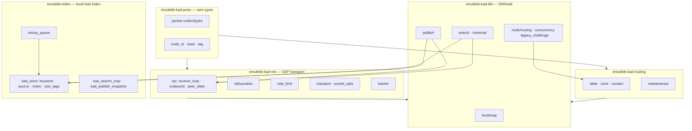
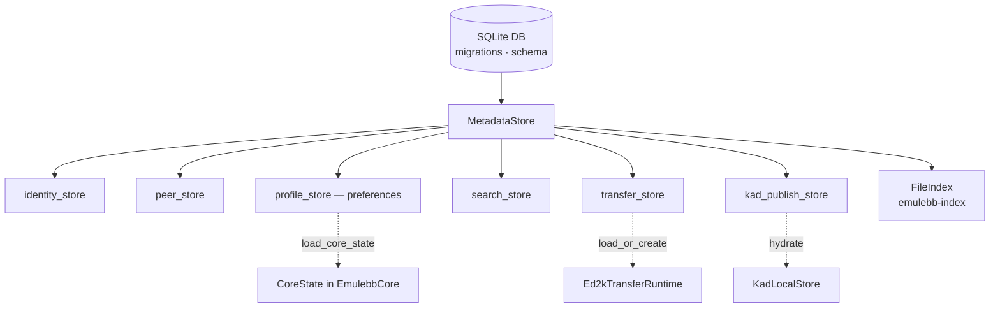

# emulebb-rust Architecture

`emulebb-rust` is the forward (Rust) eMule/Kad core: an eD2k + Kademlia peer that
runs as a headless daemon and exposes its entire control surface over a REST API
(`/api/v1/*`). It is built as a Cargo workspace of focused crates layered
**daemon → core → protocol/transfer subsystems → persistence**, with the
protocol leaf crates (`emulebb-kad-proto`, `emulebb-metadata`) carrying no
internal dependencies.

A guiding principle is **REST as the control plane**: the daemon owns the live
network state, and anything an operator or controller (e.g. TrackMuleBB) needs to
do is expressed as a REST call rather than baked into the core. The core only
carries behavior that cannot be expressed over REST.

The diagrams below are layered from the outside in: workspace crate graph →
runtime composition → eD2k internals → Kad DHT stack → persistence.

---

## 1. Workspace crate dependency graph

How the 13 workspace crates depend on each other (edges = a `[dependencies]`
entry in that crate's `Cargo.toml`).

**Legend**

- `emulebb-daemon` — the binary (`bin/emulebb-rust.rs`); wires config → stores →
  core → axum router. See `crates/emulebb-daemon/src/lib.rs`.
- `emulebb-core` — orchestration brain (`EmulebbCore`); owns live session state
  and drives the subsystems. `crates/emulebb-core/src/lib.rs`.
- `emulebb-rest` — axum router + handlers/DTOs over the core.
- `emulebb-ed2k` — the eD2k protocol + transfer engine + NAT.
- `emulebb-kad-*` — the Kademlia stack, split into `proto` (wire), `routing`
  (k-buckets), `net` (UDP RPC), `dht` (the node).
- `emulebb-index` — local Kad keyword/source index + snoop queue.
- `emulebb-metadata` — SQLite persistence (leaf, no internal deps).
- `emulebb-miniupnpc[-sys]` — UPnP IGD port-mapping FFI; `emulebb-tools` — the
  standalone NAT diagnostic binary.

---

## 2. Runtime composition & request data flow

How the process is assembled at boot and how a REST request flows into the live
network subsystems. Node names match the `EmulebbCore` struct
(`crates/emulebb-core/src/lib.rs:297`) and the per-session `Ed2kRuntime`
(`:239`).

**Legend**

- `daemon::run` reads `DaemonConfig`, opens the `MetadataStore`, builds the
  `FileIndex` and `EmulebbCore`, then serves the axum router
  (`router_with_shutdown`) — see `crates/emulebb-daemon/src/lib.rs`.
- `EmulebbCore` holds the persistent pieces (`metadata_store`, `index`,
  `ed2k_transfers`) and the optional live session `ed2k_runtime`, plus the Kad
  local store, snoop queue, shared-directory monitor and `ExternalReachability`
  (public IP + advertised ports). `crates/emulebb-core/src/lib.rs:297`.
- `Ed2kRuntime` is created on connect and torn down on disconnect; it bundles the
  server search handle, server state, the `DhtNode`, the Kad firewall verdict,
  and the `NatManager`. `crates/emulebb-core/src/lib.rs:239`.
- All routes are defined in `crates/emulebb-rest/src/routes.rs`
  (`/api/v1/app`, `/status`, `/transfers`, `/uploads`, `/servers`, `/kad`,
  `/searches`, `/shared-directories`, `/categories`, `/friends`, `/logs`, …).
- `VpnGuardMonitor` enforces the optional VPN-binding guard
  (`crates/emulebb-daemon/src/vpn_guard_monitor.rs`).

---

## 3. eD2k subsystem internals (`emulebb-ed2k`)

The eD2k crate splits into the server session, the peer-to-peer TCP protocol, the
local transfer engine, the UDP source-reask client, and the NAT/reachability
stack. Module groups map to directories under `crates/emulebb-ed2k/src/`.

```mermaid
graph TD
    subgraph server[ed2k_server — server session]
        s_sess[session / session_driver]
        s_pkt[packet_codec / packet_handler]
        s_search[active_keyword / active_source / active_callback]
        s_udp[udp_runtime]
        s_met[server_met / server_list]
    end

    subgraph tcp[ed2k_tcp — peer protocol]
        t_hello[hello / hello_gpl / identity<br/>secure ident]
        t_dl[download/session<br/>blocks · window · aich_request]
        t_listen[listener/session<br/>upload_queue · upload_payload]
        t_codec[codec: file_desc · hashset · source_exchange · upload]
        t_obf[obfuscation]
        t_transport[transport]
    end

    subgraph transfer[ed2k_transfer — local engine]
        x_coord[download_coordinator<br/>download_pick · throttle]
        x_uq[upload_queue<br/>admission · score · credit]
        x_store[piece_store · block_bitmap · store]
        x_aich[aich_tree · aich_recovery · aich_trust]
        x_hash[hashset · manifest]
        x_deliver[deliver — finished-file move]
        x_ban[ban_store · ipfilter]
    end

    subgraph udpreask[ed2k_client_udp — UDP source reask]
        u_rt[runtime / service]
        u_reg[registry · source_set · state]
        u_buddy[buddy_relay]
    end

    subgraph natstack[NAT / reachability]
        n_nat[nat: igd · miniupnpc · rupnp]
        n_stun[stun]
        n_reach[reachability]
        n_kfw[kad_firewall]
    end

    s_search --> x_coord
    t_dl --> x_coord
    t_listen --> x_uq
    x_coord --> t_dl
    x_uq --> t_listen
    u_reg --> x_coord
    t_transport --- t_obf
    n_nat --> n_reach
    n_stun --> n_reach
```

**Legend**

- `ed2k_server/` — TCP/UDP session with the eD2k server: login, keyword/source
  search, callback requests, `server.met` handling.
- `ed2k_tcp/` — the peer wire protocol: hello/secure-identification, the
  download session (block requests, request window, AICH part requests), the
  listener session (upload queue + payload serving), packet codecs, and protocol
  obfuscation over `transport`.
- `ed2k_transfer/` — the local transfer engine independent of any single peer:
  the shared download coordinator + per-file source picking + throttle, the
  upload queue (admission/score/credit), the piece store + block bitmap, AICH
  tree/recovery/trust, hashset/manifest, finished-file delivery, and the ban
  store / IP filter. Downloads are independent per-transfer tasks (no shared
  scheduler).
- `ed2k_client_udp/` — UDP source reask: registry, source set, runtime/service,
  and buddy relay for firewalled peers.
- NAT stack: `nat/` (IGD via `miniupnpc` or `rupnp`), `stun`, `reachability`
  (the resolved public IP/ports), and `kad_firewall` (UDP/TCP firewall verdict).

---

## 4. Kad DHT stack (`emulebb-kad-*` + `emulebb-index`)

The Kademlia implementation is split across four crates by concern, with the
local index crate consuming and feeding it.

**Legend**

- `emulebb-kad-proto` — the wire foundation: packet codec/types, 128-bit node id,
  hash, and tag encoding. No internal deps.
- `emulebb-kad-routing` — the k-bucket routing table (`table` / `zone` /
  `contact`) and its periodic `maintenance`.
- `emulebb-kad-net` — the UDP RPC layer: receive loop + outbound requests + per
  peer state, Kad obfuscation, rate limiting, the raw transport/socket options,
  and the tracker.
- `emulebb-kad-dht` — the `DhtNode` tying it together: bootstrap, iterative
  search/traversal, publish, routing, concurrency, and legacy challenge handling.
- `emulebb-index` — the local Kad store (keyword/source/notes/size-tag entries),
  the snoop queue (observed publishes), and the search/publish expression +
  snapshot helpers that the `emulebb-core` `kad_*` modules drive.

---

## 5. Persistence / metadata (`emulebb-metadata` + `emulebb-index`)

All durable state lives in a single SQLite database fronted by `MetadataStore`,
with typed sub-stores. The runtime objects are hydrated from these on boot.

**Legend**

- `MetadataStore` (`crates/emulebb-metadata/src/store.rs`) wraps the rusqlite
  connection; `migrations.rs` / `schema.rs` manage the schema.
- Typed sub-stores: identity (user hash / secure-ident keys), peers, profile
  (REST preferences), searches, transfers, and the Kad publish cache.
- On boot the core reads preferences via `profile_state::load_core_state`,
  rebuilds the `Ed2kTransferRuntime` from the transfer store, and hydrates the
  `KadLocalStore` from the Kad publish cache (see `EmulebbCore::new_with_network`
  at `crates/emulebb-core/src/lib.rs:353`).

---

## Where to read next

- REST contract: [`docs/rest/REST-API-OPENAPI.yaml`](../rest/REST-API-OPENAPI.yaml)
  and [`docs/rest/README.md`](../rest/README.md).
- Subsystem design notes in this folder:
  [`kad-ed2k-indexer.md`](kad-ed2k-indexer.md),
  [`source-management-and-a4af.md`](source-management-and-a4af.md),
  [`udp-source-reask.md`](udp-source-reask.md).
- Entry points: `crates/emulebb-daemon/src/lib.rs` (boot/wiring) and
  `crates/emulebb-core/src/lib.rs` (`EmulebbCore`).
